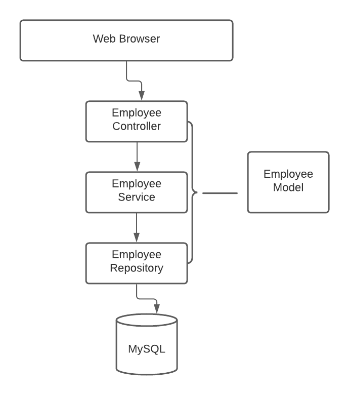

### Employees Management System

In this Github Repository, we create a Spring MVC web application for Employee Management System with the following CRUD operations:
- Get all the employees
- Add a new employee
- Update an employee
- Delete an employee

#### Architecture

#### Features 

- Configure MySQL Database
- Implement End-to-End List Employee Feature
- Implement End-to-End Add Employee Feature
- Implement End-to-End Update Employee Feature
- Implement End-to-End Delete Employee Feature
